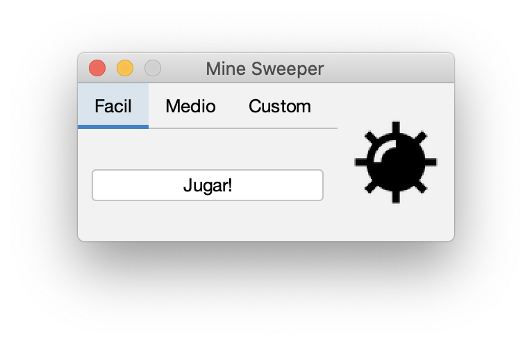
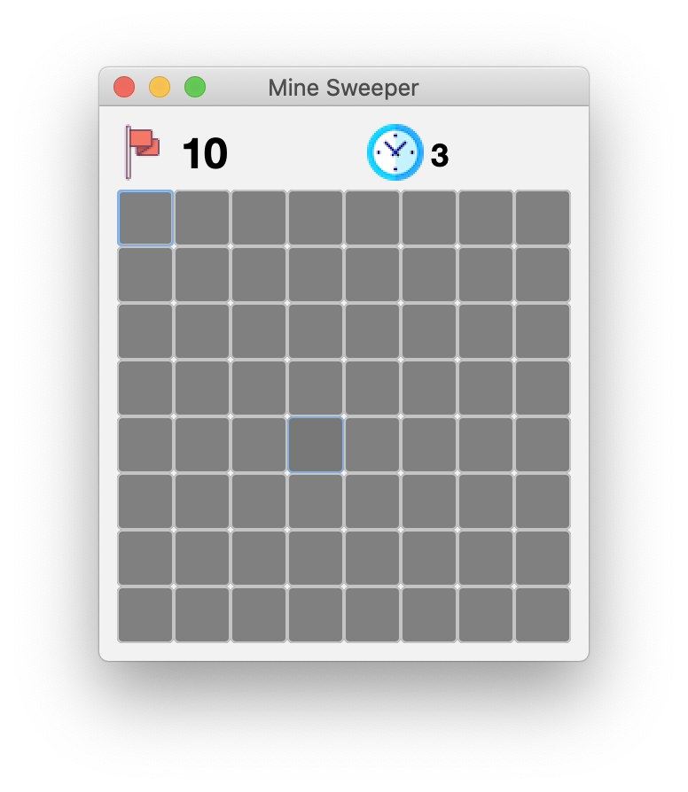
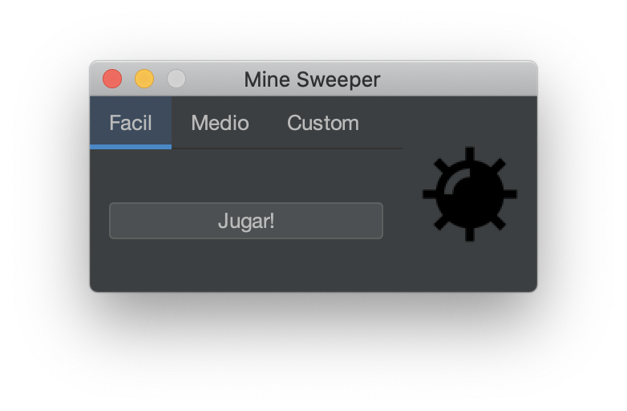
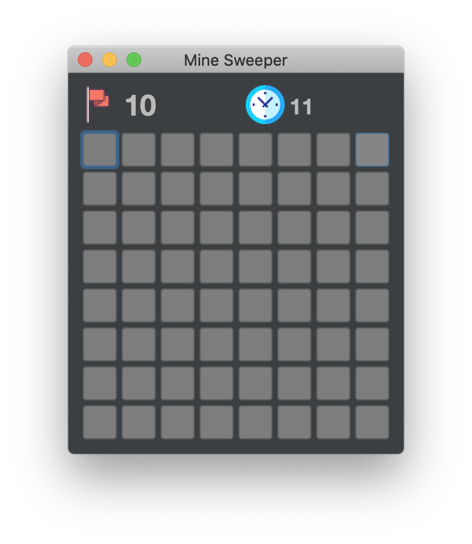

# Simple MineSweeper Written in Java

I do not own any of these resources used to create this app. This MineSweeper
app is a simple experiment as my first public GitHub repository.




It also supports themes, thanks to FlatLaf!




# Build instructions

This project uses Maven as its build system. More information about Maven on
[Apache's website](https://maven.apache.org/). To build the project on macOS and
Linux you can use the [build script](./build.sh). Alternatively, run this from
the command line to build everything:

```
mvn compile package -B
```

