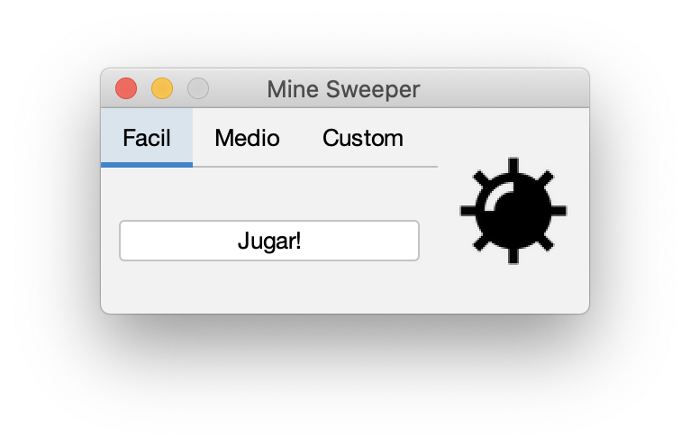
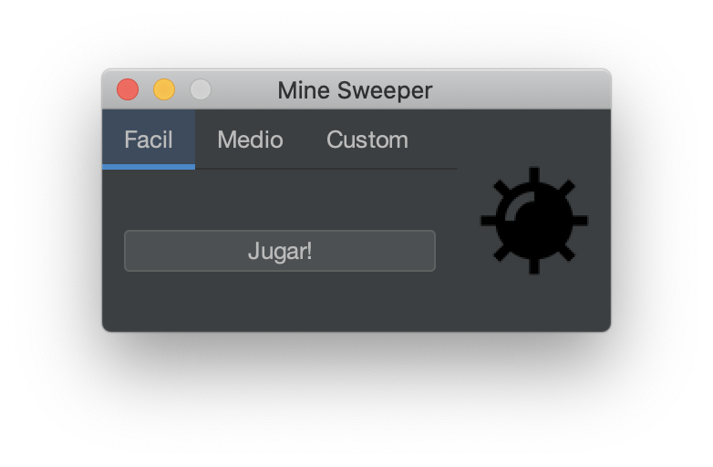
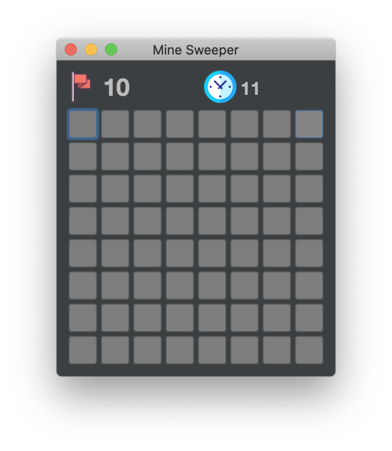

#Simple MineSweeper Written in Java
I do not own any of these resources used to create this app. This MineSweeper app is a simple experiment as my first public Github repository
The app fully supports OS X

It also supports themes, thanks to FlatLaf!

